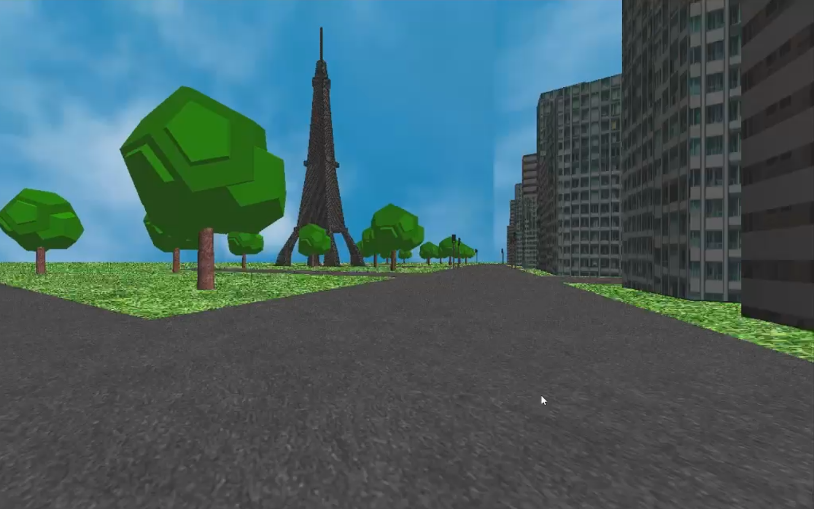

# 🗼 Explore Paris: A Virtual Driving Simulation




A **3D Paris-inspired driving simulation** built with **C++ and OpenGL**, featuring an explorable city environment, a user-controlled vehicle, multiple camera perspectives, textured buildings, animated traffic lights, and a custom-modelled Eiffel Tower.

Originally developed as an individual **Computer Graphics Programming** project at the **University of Peradeniya**.

---

## 🎮 Project Overview

**Explore Paris** is an interactive 3D driving simulation that allows the player to navigate through a miniature Paris-inspired city.

The environment combines textured roads and buildings, vegetation, traffic lights, lighting, and a Paris landmark to demonstrate fundamental computer graphics concepts including **3D transformations, camera systems, texture mapping, lighting, animation, and real-time user interaction**.

---

## ✨ Features

* 🚗 **Interactive vehicle controls** with acceleration, braking, reversing, and steering
* 🎥 **Multiple camera perspectives**

  * First-person / driver view
  * Third-person / chase view
  * Top-down city view
* 🗼 **Custom-modelled Eiffel Tower**
* 🏙️ **3D city environment** with roads, intersections, and textured buildings
* 🚦 **Animated traffic lights** with timed red, yellow, and green states
* 🌳 **Environmental objects** including grass and stylized trees
* ☁️ **Textured sky environment**
* 💡 **OpenGL lighting**
* 🚌 Additional vehicle models including **bus and motorcycle**
* 🗺️ Grid-based city layout

---

## 📸 Screenshots

### Paris-Inspired Environment

> Add your Eiffel Tower street-view screenshot here.

```html

```

### Third-Person Driving

> Add the screenshot showing the red car at the intersection here.

```html

```

### Top-Down Camera

> Add your top-down screenshot here.

```html

```

---

## 🎥 Demo

A short gameplay demo showcasing the driving system, city environment, camera modes, and other graphical features can be added here.

> **Demo video coming soon**

---

## ⌨️ Controls

| Key | Action             |
| --- | ------------------ |
| `W` | Accelerate         |
| `S` | Brake / Reverse    |
| `A` | Steer Left         |
| `D` | Steer Right        |
| `C` | Switch Camera Mode |

---

## 🛠️ Built With

* **C++**
* **OpenGL**
* **GLUT**
* **SOIL2**
* **Visual Studio**

---

## 🧠 Computer Graphics Concepts

The project demonstrates several fundamental real-time computer graphics techniques:

* 3D geometric transformations
* Translation, rotation, and scaling
* Perspective projection
* Multiple camera systems
* Texture mapping
* Surface normals
* OpenGL lighting
* Hierarchical object modelling
* Frame-based animation
* Keyboard interaction
* Procedural/environment modelling

---

## 📁 Project Structure

```text
Explore-Paris-Virtual-Driving-Simulation/
│
├── App/
│   ├── Main.cpp
│   ├── Car.cpp
│   ├── Car.h
│   ├── CityMap.h
│   ├── Cube.h
│   ├── eiffel.h
│   ├── SkyBox.h
│   ├── Texture.h
│   ├── Vehicles.h
│   └── App.vcxproj
│
├── Assets/
│   └── textures/
│
├── Modular/
│   └── Modular.sln
│
└── README.md
```

### Key Components

* **`Main.cpp`** — application initialization, rendering loop, input handling, camera system and vehicle movement
* **`Car.cpp / Car.h`** — player vehicle model
* **`CityMap.h`** — city layout, roads, buildings, vegetation and traffic lights
* **`eiffel.h`** — custom Eiffel Tower geometry
* **`Vehicles.h`** — additional vehicle models and movement logic
* **`SkyBox.h`** — sky environment rendering
* **`Texture.h`** — texture loading and OpenGL texture management

---

## 🚀 Running the Project

The project was developed for Windows using **Visual Studio and OpenGL/GLUT**.

1. Clone the repository.
2. Open `Modular/Modular.sln` in Visual Studio.
3. Ensure the required OpenGL, GLUT, and SOIL2 dependencies are configured.
4. Build the project.
5. Run the application.

> The original Visual Studio configuration may require local dependency paths to be adjusted before building on another machine.

---

## 🎓 Background

This project was originally developed as an individual project for **CSC3081 – Computer Graphics Programming** at the **Department of Statistics and Computer Science, Faculty of Science, University of Peradeniya**.

The goal was to apply fundamental computer graphics concepts to an interactive 3D environment while building the major components using C++ and OpenGL.

---

## 📄 License

This repository contains an academic/portfolio project. No open-source license is currently provided.
